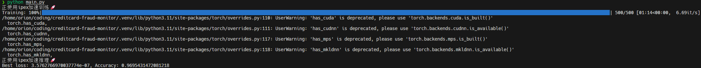
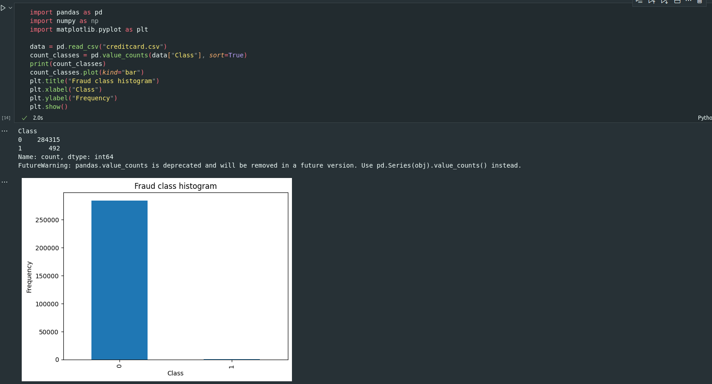
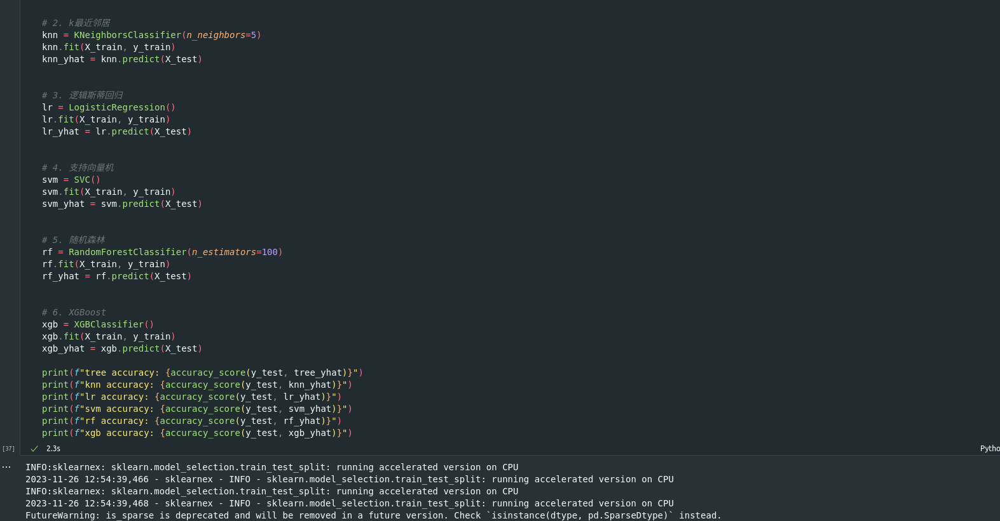
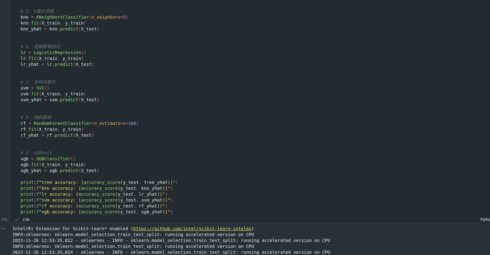
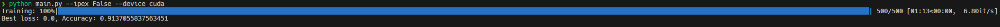

# 西安交通大学——网络保安队

## 问题重述

本项目的目标是根据过往的信用卡交易信息，构建反信用卡欺诈交易预测模型，识别一条记录是否为欺诈交易，为信用卡拥有者减少损失。

本质上来说，这是一个二分类问题，但由于样本中正样本的数量极少，也为项目添加了新的挑战。

首先我们采用欠采样的方法解决样本不平衡的问题；之后我们尝试了传统的机器学习模型，也应用了深度神经网络来对交易进行预测，总体来说深度神经网络的效果更好。

## 项目简介

本项目基于[第 13 代英特尔® 酷睿™ i5 处理器 i5-13600K](https://www.intel.cn/content/www/cn/zh/products/sku/230493/intel-core-i513600k-processor-24m-cache-up-to-5-10-ghz/specifications.html)和[英特尔锐炫™ a 系列显卡 A770](https://www.intel.cn/content/www/cn/zh/products/sku/229151/intel-arc-a770-graphics-16gb/specifications.html)编写

在项目中使用了[Intel® Distribution of Modin*](https://www.intel.cn/content/www/cn/zh/developer/tools/oneapi/distribution-of-modin.html)、[Intel® Extension for PyTorch*](https://pytorch.org/tutorials/recipes/recipes/intel_extension_for_pytorch.html)和[Intel® Extension for Scikit-learn*](https://www.intel.cn/content/www/cn/zh/developer/tools/oneapi/scikit-learn.html)对代码进行加速

使用深度神经网络构建分类器, 可以准确地识别信用卡诈骗情况, 准确率达到 **96.95%** !

## 快速上手

将本仓库克隆到本地:

```shell
git clone https://github.com/Orion-zhen/creditcard-fraud-monitor.git
cd creditcard-fraud-monitor
```

安装依赖:

```shell
pip install -r requirements.txt
```

在[展示文件](./demo.ipynb)中，阅读我们的处理流程并运行演示程序，能帮助您更快速地理解项目

## 进一步探索我们的深度神经网络

如果希望采用intel显卡完成训练和推理, 请运行:

```shell
pip install -r requirements-xpu.txt
pip install torch==2.0.1a0 intel_extension_for_pytorch==2.0.110+xpu -f https://developer.intel.com/ipex-whl-stable-xpu
```

> 值得注意的是, intel_extension_for_pytorch目前仅有Linux平台可用, 具体情况请参考[ipex官方文档](https://github.com/intel/intel-extension-for-pytorch)

开始训练:

```shell
python main.py
```

得到结果!😀



> 更多可选参数可运行`python main.py -h`查看, 如果想使用传统机器学习方法, 请浏览`classic_ml.ipynb`

## 英特尔®技术

### Intel® Distribution of Modin*

本项目使用了[Intel® Distribution of Modin*](https://www.intel.cn/content/www/cn/zh/developer/tools/oneapi/distribution-of-modin.html)来对pandas数据处理进行优化和加速

以数据可视化部分为例，在未使用modin进行优化时，将全部数据装入并绘制分布图所需的时间为2.0s



而在使用modin之后，所需时间仅为1.3s


modin的使用也十分简单方便

只需将原先的

```python
import pandas
```

替换为

```python
import modin.pandas
```

即可在无需更改代码的情况下使用modin优化

### Intel® Extension for Scikit-learn*

本项目使用[Intel® Extension for Scikit-learn*](https://www.intel.cn/content/www/cn/zh/developer/tools/oneapi/scikit-learn.html)来对传统机器学习模型进行优化和加速

我们在传统机器学习案例中使用了sklearn支持的以下分类模型：

* 决策树
* k最近邻居
* 逻辑斯蒂回归
* 支持向量机
* 随机森林

在未使用intel优化之前，执行时间如下所示



使用intel优化之后，情况如下所示



如果想在代码中使用intel优化后的sklearn，无需对源代码进行逐个修改，仅需在引入sklearn之前作如下操作

```python
from sklearnex import patch_sklearn
patch_sklearn()
```

在函数patch_sklearn()填写需要进行加速的机器学习模型，如果不填写参数的，则默认对所有模型有限使用intel优化后的sklearn

目前，intel可以加速的sklearn模型参考[官方文档](https://www.intel.com/content/www/us/en/developer/tools/oneapi/scikit-learn.html)

### Intel® Extension for PyTorch*

本项目使用[intel_extension_for_pytorch](https://github.com/intel/intel-extension-for-pytorch)来对pytorch训练和推理进行优化和加速

想要使用ipex优化模型训练, 只需要在代码中加入如下几行:

```python
import intel_extension_for_pytorch as ipex

optimizer = torch.optim.something
model.train()
model, optimizer = ipex.optimize(model, optimizer=optimizer, dtype=torch.float32)
model = torch.compile(model, backend="ipex") # 实验性功能, 可以获得更强效果
```

想要使用ipex优化模型推理, 则可以这样:

```python
import intel_extension_for_pytorch as ipex

model.eval()
model = ipex.optimize(model)
model = torch.compile(model, backend="ipex") # 实验性功能, 可以获得更强效果
```

以下是使用ipex优化加速的结果和使用cuda加速的结果对比:

ipex


cuda



可以看到, ipex带来了非常可观的准确率提升

## 心得体会

和其他的加速框架相比，Intel的加速框架最显著的特点就是简单易上手，不需要对已经写好的代码进行大范围的改动。

同时优化后的代码效果显著，执行速度有了很可观的提升，不论是对大数据量还是小数据量的内容，都有很好的加速效果。
